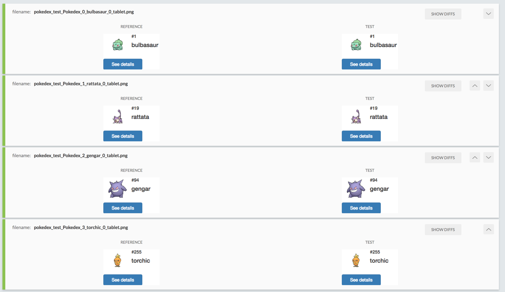

# Visual Regression with BackstopJS

A small example of visual regression testing with [BackstopJS](https://github.com/garris/BackstopJS) in a pokedex application.

- A pokedex web app using AngularJS and [Pokeapi.co](http://pokeapi.co/).

- This app was based in <https://github.com/alvarowolfx/ng-pokedex/> 

# How to run the application

Install required npm packages, run this command on project folder :

  ```
  npm install
  ```

Start livereload server

  ```
  npm start
  ```


# How to run tests

Inside `visual-regression` folder :

```
npm install
  ```

```
npm test
  ``` 

To promote images to baseline:

```
npm approve
  ``` 

## Example


